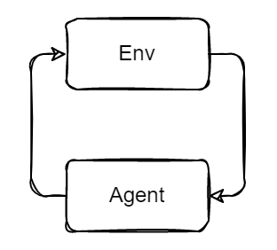
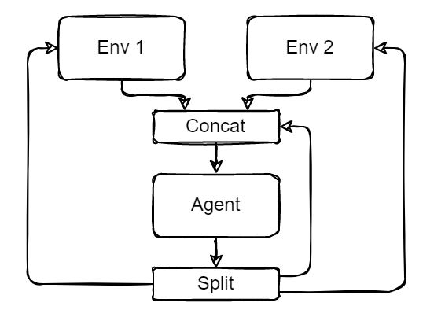
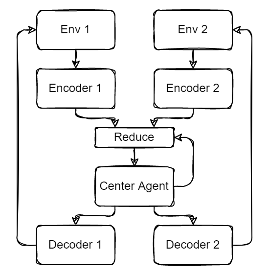
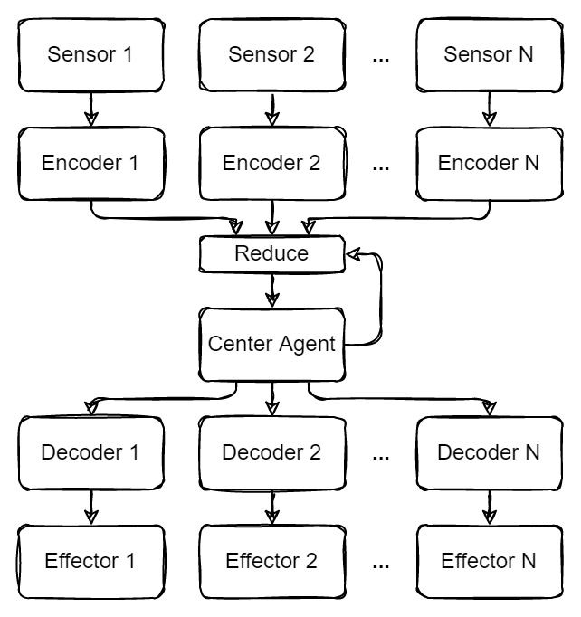

# Chaining agents

## Rationale
### A simple scenario
First, we start with a simple RL scenario consisting of a single environment and a single agent.

### Multiple environments
But what if we want to act in multiple environments? Assuming the observations and actions of the environment have the same rank, we can concatenate the observations, feed them to the agent, and split the agent's output into separate actions per-environment. We can also turn a non-recurrent agent into a (single-step stateful) recurrent one by concating and splitting a separate memory vector and feeding it back to the agent at every timestep.

### Introducing encoders and decoders
Unfortunately, the scenario above couples the agent's observation and action spaces to the spaces of the environments. In other words, you cannot add additional environments without discarding the previous agent and training a new one (or, perhaps, resizing existing neural networks). Instead, additional nodes (potentially RL agents) can be introduced, called "encoder" and "decoder" nodes. Encoders each convert their respective observations into vectors of equal size. Decoders convert same-size vectors into actions, which are finally fed back to the environments. Encoder vectors can be `Reduce`d (e.g. sum or mean) and fed to the center agent. The center agent's output can then be copied and fed to each decoder node. If the encoder-side and decoder-side vectors are the same size, the center agent can recursively feed its own output to the reduce step.

In this scenario, a single agent can interact with an arbitrary number of environments. Experience from each environment can potentially be expolited in other environments. Additionally, environments can be added and removed at any time without reconfiguring the center agent. This will likely lead to distribution differences in encoder/decoder vectors, therefore causing the agent to perform poorly.

### Transitioning from environments to sensors and effectors
The sum of environments the agent interacts with can be considered a single ("the") environment. The agent observes the environment through its sensors and acts upon it with its "effectors". In the previous scenario, we establish that an abitrary number of environments can be added and removed from an agent, and likewise here, sensors and effectors can be added and removed at will.

