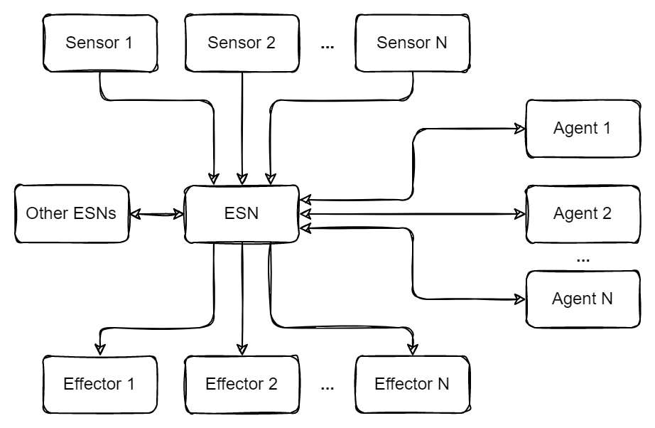

# Echo state networks

Using ESNs as arbitrary computation/memory for multiple sensors, effectors, and agents

An alternative method is to have RL agent "encoders" and "decoders" between sensors/effectors and the central ESN

## TODO
- note how a similar framework can be used with (non-computing) memory banks
- mention chonky
