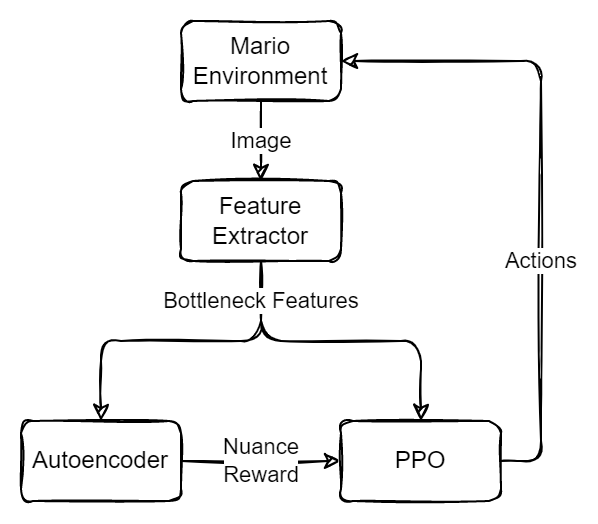
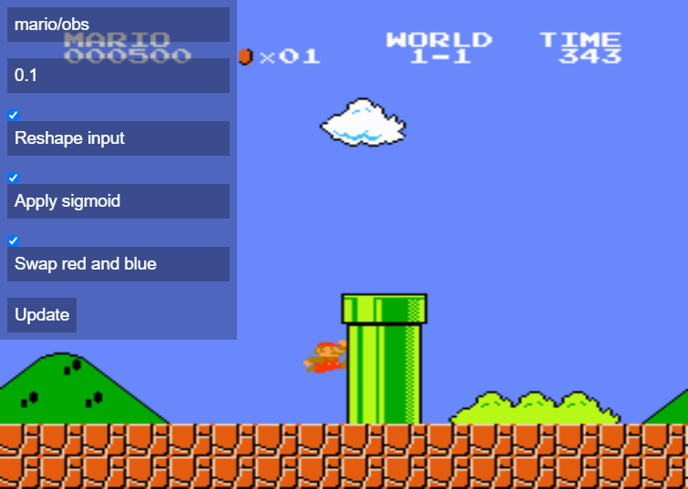
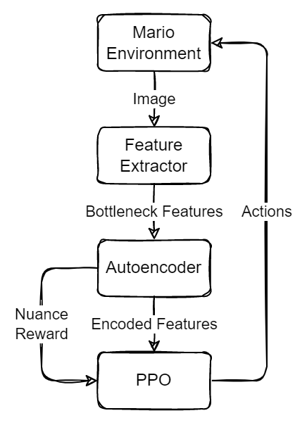

# Mario/PPO/Curiosity

Attempt to train a PPO agent to explore SMB using only intrinsic curiosity/surprise-like reward. Uses an *un-finetuned* mobilenet_v2 (imagenet weights) feature extractor to "see" the screen.

## Setup
Build an autoencoder model:
```
docker-compose run --rm builder dense_ae [1280] --latent-size 32 - compile - save "models/ae.h5"
```

## Structure


## Questions
### Can the agent learn that moving right is "good" (i.e. yields more "nuanced experiences")?
**12/28/2021**: after ~100k steps, it appears that the agent does in fact learn to primarily move right. It frequently gets stuck on the early pipes in 1-1, but has made it at least once to stage 1-2. More test runs are needed to confirm results.



## Alternative design
What about feeding AE-encoded features to PPO instead of the feature extractor's bottleneck features?



## TODO
- try feeding AE-encoded features to PPO?
- add description of experiment
- document usage
- try randomsearch to find optimal hyperparameters
  - launch containers and link them with a network
- reset and retest to confirm 12/28/2021 result
