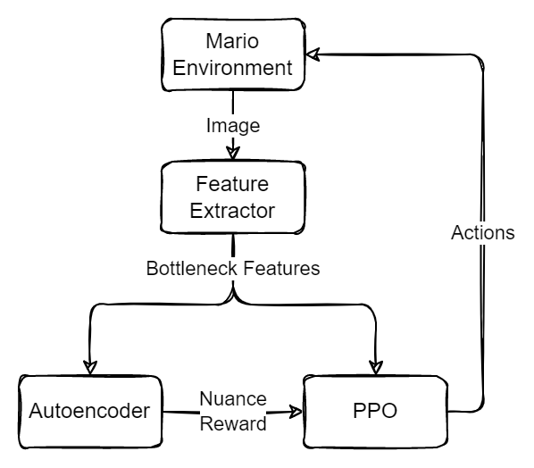
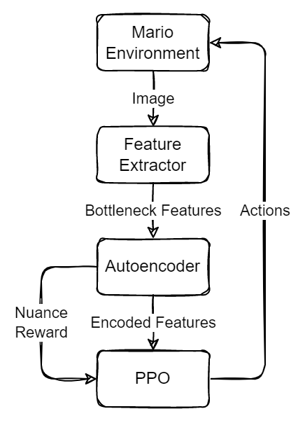

# Mario/PPO/Curiosity

Attempt to train a PPO agent to explore SMB using only intrinsic curiosity/surprise-like reward

## Setup
Build an autoencoder model:
```
docker-compose run --rm builder dense_ae [1280] --latent-size 32 - compile - save "models/ae.h5"
```

## Structure


## Questions
* Can the agent learn that moving right is "good" (i.e. yields more "nuanced experiences")?

## Alternative design
What about feeding AE-encoded features to PPO instead of the feature extractor's bottleneck features?



## TODO
- try feeding AE-encoded features to PPO?
- add image/description of experiement
- document usage
- document experiement results
- use randomsearch to find optimal hyperparameters
  - launch containers and link them with a network
