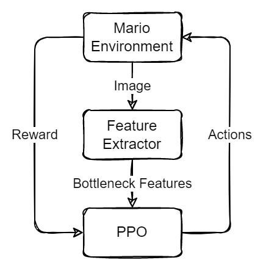

# Mario + Feature Extractor + PPO

Testing using a pretrained Keras app feature extractor to reduce the dimensionality of the Mario env's observation.

## Experiment

### Structure

## Nodes used
keras-app, mario, ppo

## Results
Preliminary results from mario-ppo-curiosity show that a pretrained feature extractor could provide a rich enough description of the game screen to solve simple tasks in-game.

## Implications
If this works,
* One feature extractor can potentially be reused for a multitude of game screens, cameras, etc.

## TODO
- add description of experiment
- document usage experiment
- document experiment results
- use randomsearch to find optimal hyperparameters
  - launch containers and link them with a network
- potentially combine with other mario-ppo experiments and use env vars to control curiosity and ae features on/off
  - this may require conditional compose file edits (eg obs size of PPO net..) so may not be a good idea
