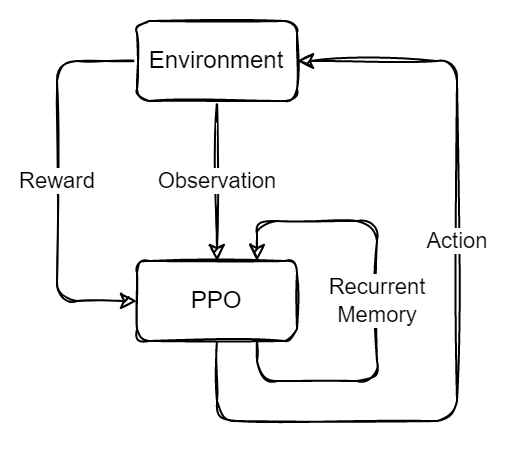

# PPO with recurrent memory

Split PPO's action into "action" and "memory" parts, concat the observation with "memory" as input to PPO.

After starting, TensorBoard should be available available at http://localhost:6006

## Experiment
**Preliminary**: Confirm that an agent can learn in a simple environment when an explicit memory vector is used.

**Future**: Run combinations of different numbers of "blanked out frames" and memory vector sizes and see how the scores compare.

## Structure

## Nodes used
vanilla-env, ppo, tensorboard-logger

## Questions
- How does explicitly passing a memory vector affect the performance of the agent in Markovian environments?
- Does the explicit memory vector allow for solving non-Markovian environments?

## TODO
- add description of experiment
- document usage
- document experiment results
- on "sentience"
- separate compose profiles for recurrent/nonrecurrent nodes to compare?
- determine appropriate reward scale if needed
- use better metric than average reward over all timesteps
  - better would be average over last N episodes
